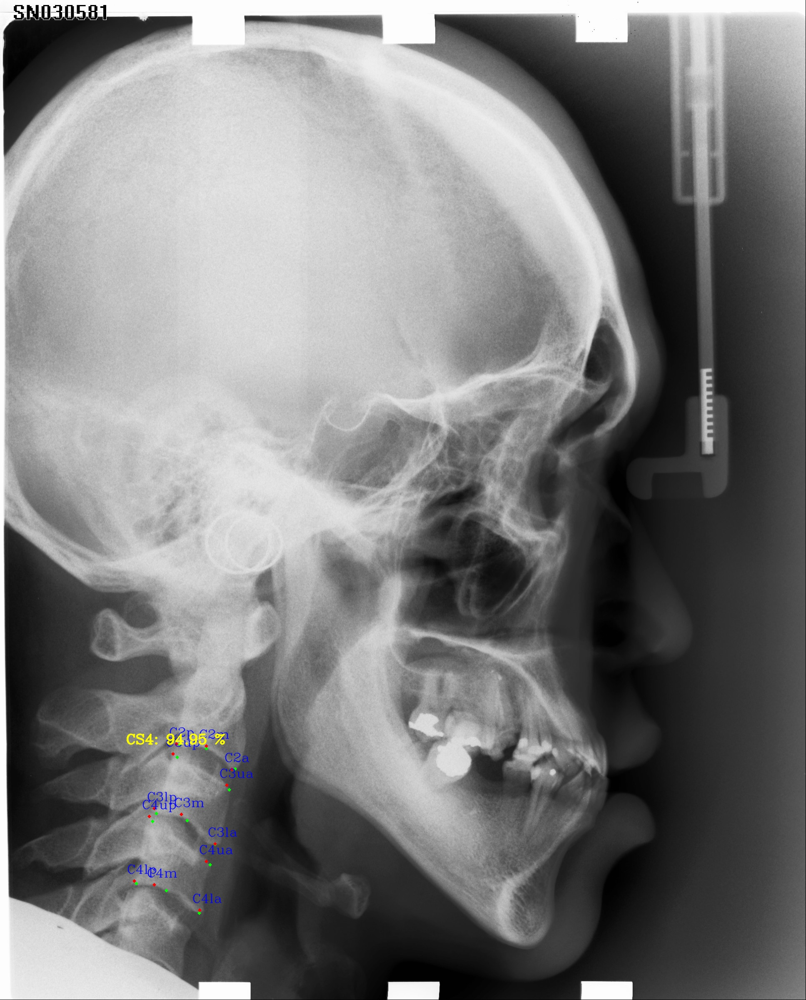
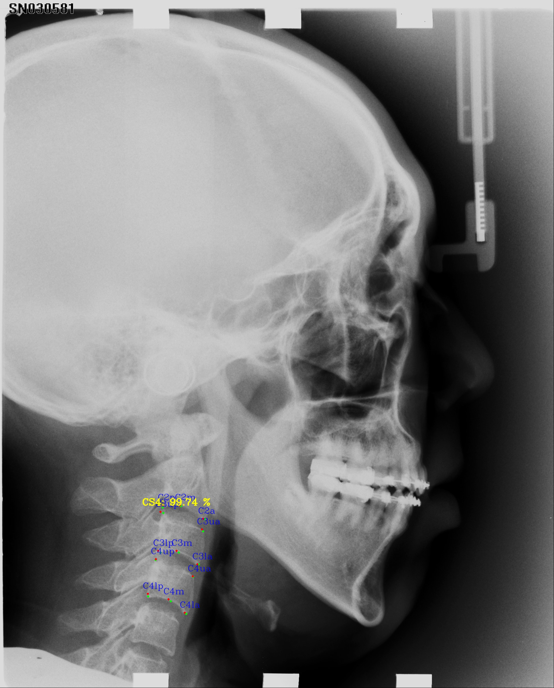
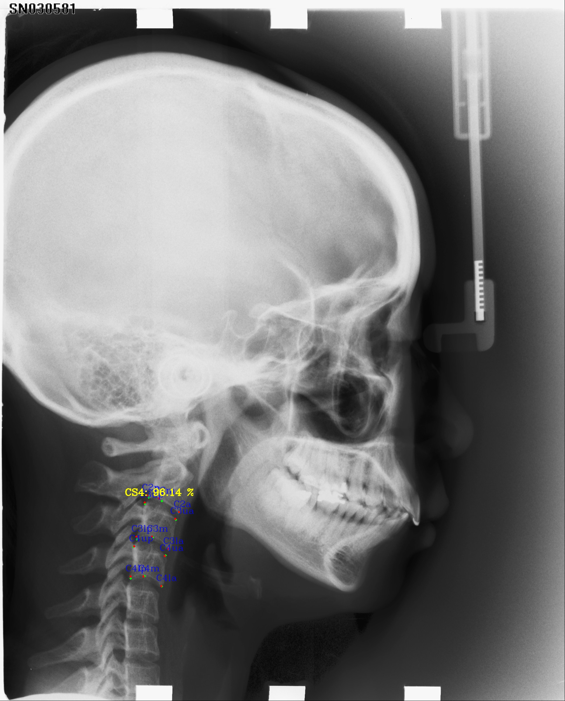
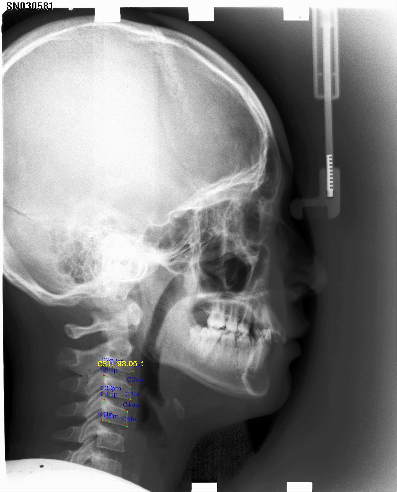
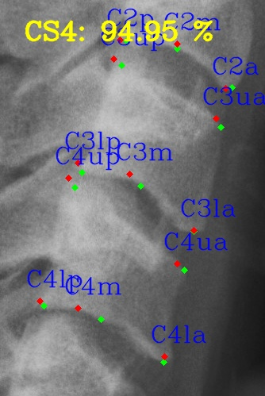
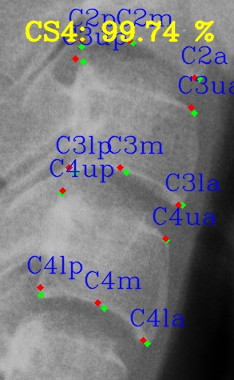
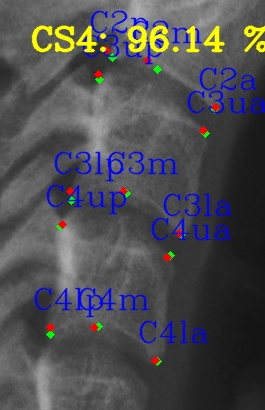
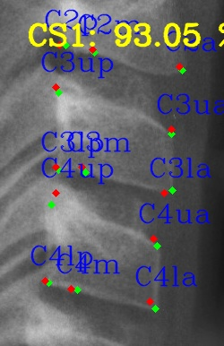
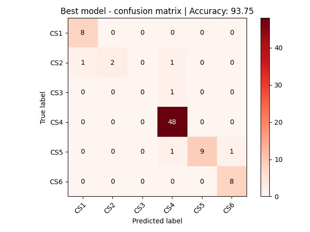
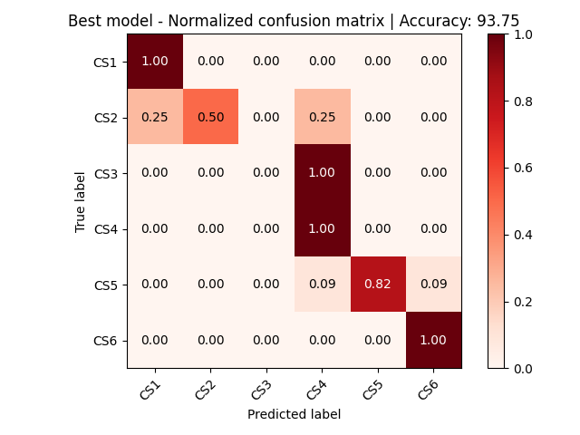

# Fully automated solution for Cervical Vertebral Maturation (CVM) assessment by deep learning approaches
### (By Vietnamese Orthodontic Research Group - VORG)
# Introduction
Deep learning approaches have recently used in many studies of CVM
(the cervical vertebral maturation) degree classification. Although,
some studies showed high precise results, the features that the models
learned are difficult to clinically explain. Therefore, it needs to do a lot
of effort in improving the model accuracy.
In this study, we developed a fully automated deep learning solution of
CVM classification procedure that consistently follow to CVM
assessment clinical research.
submitted our method to Association of Orthodontists (Singapore)
Congress 2023 - AOSC 2023
This git contains code for Cervical Vertebral Maturation (CVM) assessment by deep learning approach.

# Dataset
In this study, we used public dataset IBSI 2015 Challenge - Grand Challenges in Dental Xray Image Analysis.
We annotated 13 CVM landmark points on the bodies of C2, C3, C4 cervical vertebral. 
Each image then be annotated to six different maturational stages from CS1 through CS6
We separated 400 images from IBSI 2015 Challenge to train set and test set
- Train set: 320 images (80%)
- Test set: 80 images (20%)

# Method
This study aimed to establish and evaluate a new AI method for
determining classification cervical vertebral maturation (CVM) by
analyzing lateral cephalometric radiographs based on clinical
research.

### Environment setup
* Pytorch >=1.11
* CUDA Version: >=11.3
* CUDNN version: >=8 
* OS: Ubuntu >=20.04
* Python3 version: >=3.8.10

#### Install dependencies

```commandline
pip install ./requirements.txt
```

##### Setup environment variables to source code 
```
export PYTHONPATH=/path/to/your/src/:$PYTHONPATH
```
Example:
```
export PYTHONPATH=/path/to/your/src/:$PYTHONPATH
```

### 3. Data annotation and training

In this project, we use CVAT for annotating landmarks on cephalometric images.
List of CVM landmarks, refer to `./data/points_labels_v2.py`
The annotation from CVAT must be export in "CVAT for image 1.1"
1. Structure of input image folder and its annotation in xml file as below :
```
IBSI2015
├── train
│   ├── images
│   │   ├── 001.jpeg
│   │   ├── 002.jpeg
│   │   ├── ...
│   │   
├── test
│   ├── images
│   │   ├── 280.jpeg
│   │   ├── 281.jpeg
│   │   ├── ...
│   │   
├── annotations.xml
```

### 4. Configuration for model train and evaluation
Modify file `./configs/configuration`


```
    CVM_data_dir = ''   ##### input data dir
    data_type = 'public' #### Public (IBSI2015), Private (our own data)
    data_version = 'v1.0' #### set version for your data
    light_weight_model = False  ### False: using Cephalandmark_v2 model (Backbone Densnet121) | True: Cephalandmark_v2 (Backbone mobilenet_v3)
    label_type = 'xml'  ### CVAT annotation format (don't change this)

    CVM_landmarks_experiment_name = ''  ### Set name for your CVM landmark experiment. Ex: CVM_landmarks_20240925
    CVM_classification_experiment_name = '' ### Set name for your CVM classification experiment. Ex: CVM_classification_20240925 
    visualization = False  ### Use when you want to visualize input data with annotation
    visualize_output_on_training = False ### Use when you want to visualize output result
    draw_output_image = False ### Use when you want to visualize output result with detected landmarks
    export_detect_point_to_json = False  ### Use when you want to export inferenced result to json format
    
    transform = False
    multi_gpus = False
    n_gpu = 2
    gpu_id = 0
    resume = False
    base_number = 40
    resize_h = 512
    resize_w = 480
    sigma = 10

    num_epochs = 110
    lr = 1e-4
    lr_step_milestones = [30, 60, 90]
    # lr_step_milestones = [0,1,2]
    debug_steps = 10
    validation_step = 5
    batch_size = 1
    save_weight_every_epoch = 5
```

### 5. Train and evaluation
1. Train and eval CVM_landmark models
```commandline
python3 1.1.Train_CVM_landmarks.py
```
or
```commandline
python3 1.2.Eval_CVM_landmarks.py
```
Running inference with CVM_landmark models
```commandline
python3 1.3.Inference_CVM_landmarks.py
```
2. Train and eval CVM_classification model
```commandline
python3 2.1.Train_CVM_classification_with_catboost_from_running_model.py
```
or
```commandline
python3 2.2.Eval_CVM_classification_with_catboost.py
```
3. Run inference with fully CVM assessment
```commandline
python3 3.Inference_fully_CVM_assessment.py
```
# Results
#### Here are some output results of the proposal method:
- Green landmark: Ground truth
- Red landmark: Prediction

<div style="display: flex; justify-content: space-between;">
    
    
    
    
</div>

#### Here are some output results of the proposal method after cropped

<div style="display: flex; justify-content: space-between;">
    
    
    
    
</div>

#### Evaluation result of fully CVM assessment with catboot (on test set)

<div style="display: flex; justify-content: space-between;">
    
    
</div>

# Reference
The implementation of this study based on below paper:
- [The cervical vertebral maturation method: A user's guide](https://pubmed.ncbi.nlm.nih.gov/29337631/)

# Author
- Thanh Nguyen Huy (nhthanh0809@gmail.com, thanhhn@medbrainlab.com, https://github.com/nhthanh0809)
